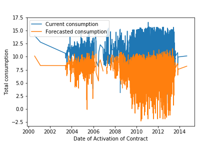
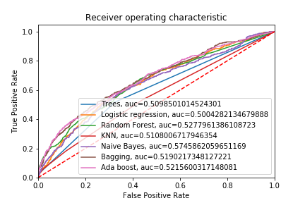

# Churn Prediction

## Description

Leveraged descriptive statistics and visualisation for extracting interesting insights from provided data. 
Created the model by applying decision trees, logistic regression, random forest XGBoost, Naive Bayes and SVM classifiers in Python. 
Finally created ensemble of models to deliver the best solution and suggested which commercial actions should be taken as a result of the model's outcome.

The repository includes:
* Source code for analysis in Jupyter notebooks to visualise the results.
* Initial datasets to make analysis.
* Presentation with results and action plan.

## Usage
### Requirements
* `Pandas version 0.23.2`
* `Seaborn version 0.9.0`
* `Matplotlib version 2.2.2`
* `Numpy version 1.14.5`
* `Xgboost`
* `Sklearn`

For reproducing the results, download repository and run the **Churn_prediction.ipynb** file.

## License
Copyright (c) 2018 Ekaterina Lyapina. Contact me for commercial use (or rather any use that is not academic research) (email: aegorfk at gmail.com). Free for research use, as long as proper attribution is given and this copyright notice is retained.
